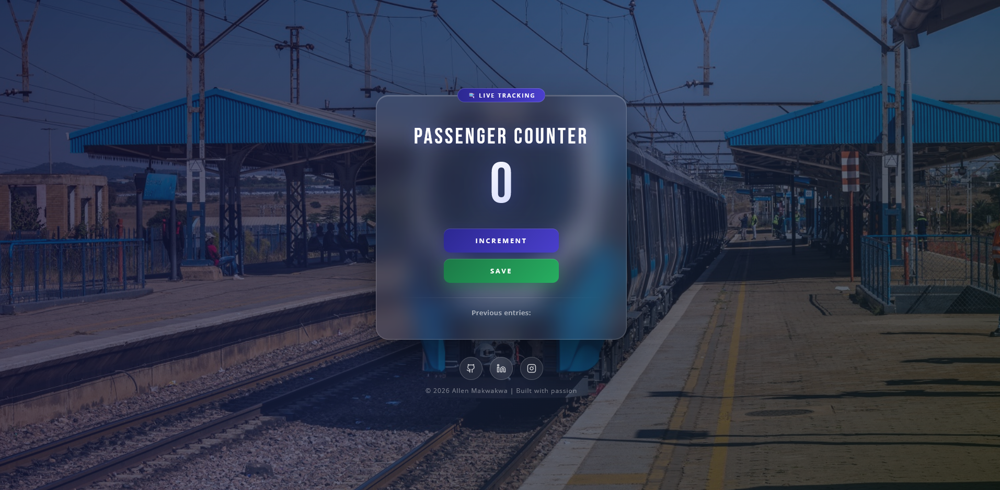

#  Passenger Counter

A lightweight web application built using **HTML**, **CSS**, and **JavaScript** that allows users to increment and save passenger counts dynamically. The project demonstrates core JavaScript concepts such as DOM manipulation along with responsive UI styling using CSS.

---

##  Live Demo

 **[passengercounter-allen.netlify.app](https://passengercounter-allen.netlify.app/)**

---

##  Preview

<!-- Screenshot -->

---

##  Features

- **Increment counter** — tap the INCREMENT button to count each passenger as they board
- **Save & reset** — save the current count to the log and reset to zero for the next entry
- **Previous entries log** — all saved counts are displayed in a running history

---

##  Built With

| Technology | Purpose |
|---|---|
| HTML5 | Structure & markup |
| CSS3 | Styling |
| JavaScript  | DOM manipulation, counter logic |
| Netlify | Deployment & hosting |

---

## How It Works

1. Click **INCREMENT** each time a passenger boards — the counter increases by 1
2. Click **SAVE** to log the current count and reset to 0 for the next batch
3. All saved entries appear below the buttons as a running record

---

## Connect

  <a href="https://github.com/ALLEN-MAKWAKWA">GitHub</a> •
  <a href="https://www.linkedin.com/in/allen-makwakwa">LinkedIn</a> •
  <a href="https://www.instagram.com/ma_alvo_/">Instagram</a>

---

© 2026 Allen Makwakwa | Built with passion
